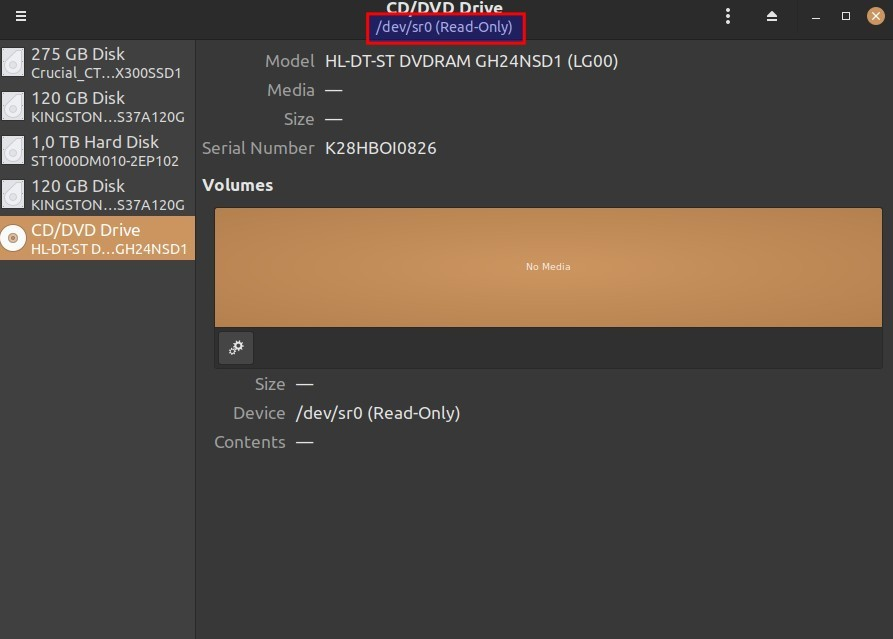

# DVC running on Nvidia Jetson Xavier NX
- [DVC running on Nvidia Jetson Xavier NX](#dvc-running-on-nvidia-jetson-xavier-nx)
  - [R/W data on SD card](#rw-data-on-sd-card)
  - [Powering Jetson](#powering-jetson)
  - [Setup Jetson](#setup-jetson)
  - [Installing Warpinator](#installing-warpinator)
  - [Setting up Ardupilot on Pixhawk](#setting-up-ardupilot-on-pixhawk)

## R/W data on SD card

To get image of your card on linux system just go to terminal and write:
```
sudo dd if=/dev/{NameOfDisc} of=/{CustomName}.img
```
To get back your content use:
```
sudo dd if=/{CustomName}.img of=/dev/{NameOfDisc}
```
Name of your device should be visible in discs (look picture below)



## Powering Jetson

Jetson runs in range from 9V to 19V and gets maximum current of 5A while on 9V.

## Setup Jetson 

1. Download Etcher: https://www.balena.io/etcher#download-etcher
2. Upload your chosen image 
3. Boot and Configure
4. Install updates 
5. Install ROS, MavProxy and Yolo step by step as shown in [prerequistes](prerequisites.md).
   
**WARNING!** When i was installing newest version i came across key error with easy fix
   ```
   sudo apt-key del 421C365BD9FF1F717815A3895523BAEEB01FA116
   sudo -E apt-key adv --keyserver 'hkp://keyserver.ubuntu.com:80' --recv-key C1CF6E31E6BADE8868B172B4F42ED6FBAB17C654
   sudo apt clean && sudo apt update
   sudo apt install
   ```

**WARNING!** Before installing yolo on jetson you will need to add:
  ```
  export PATH=/usr/local/cuda/bin${PATH:+:${PATH}}
  export LD_LIBRARY_PATH=/usr/local/cuda/lib64\${LD_LIBRARY_PATH:+:${LD_LIBRARY_PATH}}
  ```
  to your ```.bashrc``` file
  
  Replace your darknet folder with cloned from: https://github.com/AlexeyAB/darknet
  
  Then in makefile of darknet change parameters to: 
  ```
  GPU=1
  CUDNN=1
  OPENCV=1
  ```
  And go ahead: ```make```.

  Assuming you named your datasets obj like i did: move all weights and use them with command:
  ```
  ./darknet detector demo cfg/obj.data cfg/obj.cfg obj.weights "nvarguscamerasrc auto-exposure=1 ! video/x-raw(memory:NVMM), width=(int)1280, height=(int)720, format=(string)NV12, framerate=(fraction)60/1 ! nvvidconv flip-method=0 ! video/x-raw, width=(int)1280, height=(int)720, format=(string)BGRx ! videoconvert ! video/x-raw, format=(string)BGR ! appsink -e"
  ```

## Installing Warpinator
First, use the given command to install some prerequisite dependencies:
```
sudo apt install python3-grpc-tools python3-grpcio
```
Now clone the Warpinator repository by using –
```
git clone https://github.com/linuxmint/warpinator.git
```
Move to the downloaded directory –
```
cd warpinator
```
If you are using GitHub actions to compile then install the following dependencies –
```
sudo apt -y install debhelper dh-python gnome-pkg-tools meson gobject-introspection appstream python3-grpc-tools
```
Now build the deb package by using the given command –
```
dpkg-buildpackage --no-sign
```
Go back to home dir
```
cd ..
```
Finally, run the given command to install the deb package –
```
sudo dpkg -i *warp*.deb
```
If it shows any dependency error then run –
```
sudo apt install -f
```
Press y and then enter when it asks for your confirmation.


## Setting up Ardupilot on Pixhawk

Open qGroundStation 
```
./QGroundControl.AppImage
```
Click on Q -> Vehicle Setup -> Firmware 

Once you are in this window go ahead and replag the px.

Default configuration shall be fine :) 

