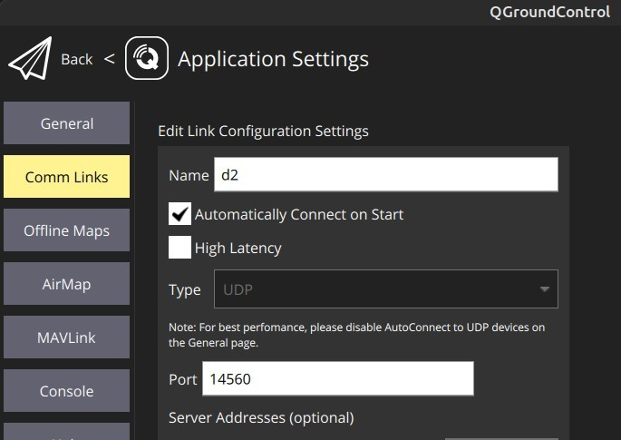

# Running roslaunch files (simulation and programs at once)

Inspired by [Inteligent Quads](https://github.com/Intelligent-Quads).


## Table of Contents
Running roslaunch files
  - [Prerequisites](#prerequisites)
  - [Dependencies (empty worksapce)](#dependencies-empty-worksapce)
  - [Installing DVC](#installing-dvc)
  - [Running program and simulation](#running-program-and-simulation)
  - [Starting mission](#starting-mission)

## Prerequisites

All prerequisites are stored in [this file](prerequisites.md).
If you also made your catkin workspace just like shown in attachted file go ahead and skip dependencies section as you should have all you need.

## Dependencies (empty worksapce)

Please check if you have all software installed by going through [Prerequisites](#prerequisites).

If you want to start with empty catkin warkspace you will need to get packages that are required by dvc:
1. Basic ros/mavros  
    
    ```
    mkdir -p ~/catkin_ws/src
    cd ~/catkin_ws
    catkin init
    ```

    From catkin_ws directory run:

    ```
    wstool init ~/catkin_ws/src
    rosinstall_generator --upstream mavros | tee /tmp/mavros.rosinstall
    rosinstall_generator mavlink | tee -a /tmp/mavros.rosinstall
    wstool merge -t src /tmp/mavros.rosinstall
    wstool update -t src
    rosdep install --from-paths src --ignore-src --rosdistro `echo $ROS_DISTRO` -y --os=ubuntu:focal
    catkin build
    ```

    Resorce

    ```
    echo "source ~/catkin_ws/devel/setup.bash" >> ~/.bashrc
    source ~/.bashrc
    sudo ~/catkin_ws/src/mavros/mavros/scripts/install_geographiclib_datasets.sh
    ```
2. Iq sim which you can get directly from [Inteligent Quads](https://github.com/Intelligent-Quads) or [my image of iqs repo](notyet).
   
    ```
    cd ~/catkin_ws/src
    git clone https://github.com/Intelligent-Quads/iq_sim.git
    echo "GAZEBO_MODEL_PATH=${GAZEBO_MODEL_PATH}:$HOME/catkin_ws/src/iq_sim/models" >> ~/.bashrc
    cd ~/catkin_ws
    catkin build
    source ~/.bashrc
    ```
3. YOLO from darknet
    ```
    cd ~/catkin_ws/src
    git clone https://github.com/kunaltyagi/darknet_ros.git
    cd darknet_ros
    git checkout opencv4
    git submodule update --init --recursive
    ```
    Building:
    ```
    catkin build -DCMAKE_BUILD_TYPE=Release -DCMAKE_C_COMPILER=/usr/bin/gcc-8
    ```


## Installing DVC

It is as simple as running this command set:

```
cd ~/catkin_ws/src
git clone https://github.com/printfKrzysztof/Drone-Visual-Controler.git
catkin build -DCMAKE_BUILD_TYPE=Release -DCMAKE_C_COMPILER=/usr/bin/gcc-8
```

## Running program and simulation

To run program you type in unused terminal:

```
roslaunch dvc dronevisualsim.launch
```

In terminal no. 2 type:
```
./startpray.sh
```

In terminal no. 3 type:
```
./startdrone.sh
```

In terminal no. 4 type:
```
rosrun dvc pilot
```

**If you use VS CODE you can use Tasks added by me.**


You can also use mission commander if you want:

```
cd MissionPlanner-latest/
mono MissionPlanner.exe
```
or setup your qGrandControl
```
./QGroundControl.AppImage
```
Remember to setup your drone connection as shown:


## Starting mission

To start mission simply type in terminal no.2 and no.3 
```
mode GUIDED
```
Which will tell software in the loop to start mission. Then by chaging position of prey our drone shall follow it.

