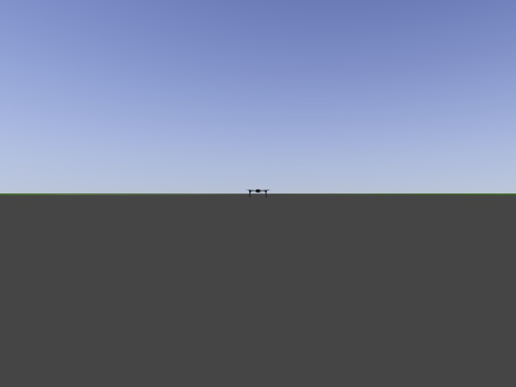

# Training dataset to use in yolo


Training dataset to use in yolo
  - [How does it work](#how-does-it-work)
  - [Getting images](#getting-images)
  - [Geting txt files](#geting-txt-files)
  - [Training yolo v2](#training-yolo-v2)
  - [Putting our weights to ros](#putting-our-weights-to-ros)
- [Contact:](#contact)
- [Direct Sources:](#direct-sources)
---
## How does it work
We need to get pictures with our object that we want to include. Then we make txt file where we give position of our object using bounding boxes. 

Example data_set (picture + txt file):



<p style="text-align:center"> data.txt </p>

>0 0.498437 0.494792 0.056250 0.047917

Then we generate weights using Darknets Yolo repo.

## Getting images

To get images of drone i used simulation therfore created roslaunch file. Given launchfile can be awaken by typing in terminal:
```
roslaunch dvc training_session.launch
```
Then opening both software in the loop terminals as described in [Running Simulations Documentation](running_simulations.md). And after setting both modes to GUIDED you need to wait for mission to start.

When mission starts to get your images all you need to do is type in new terminal
```
rosrun image_view image_saver image:=/webcam/image_raw
```

## Geting txt files

After you got your images you are ready to generate txt files. It can be achived by manually creating each file or using tool for it like: 

https://github.com/heartexlabs/labelImg

It is easy to use and install. Just remember to set YOLO option to generate txt files.

## Training yolo v2

Get yolos repo: https://github.com/AlexeyAB/darknet.git

You need to generate 5 files:
1. Two of them need to go darknet folder:
- train.txt
- test.txt      
2. Three of them go to cfg folder inside darknets folder:
- obj.cfg
- obj.names
- obj.data

In addition we need more datasets so that our AI doesn't overlearn one sheme: 
  
https://pjreddie.com/media/files/darknet19_448.conv.23

By clicking this link you will get there.

When you done go ahead and type in the main darknet folder:
```
./darknet detector train cfg/obj.data cfg/obj.cfg darknet19_448.conv.23
```

## Putting our weights to ros

As descirbed in [our darknet ros repo](https://github.com/kunaltyagi/darknet_ros) we need to put our newly generated weights and config into

```
catkin_workspace/src/darknet_ros/darknet_ros/yolo_network_config/weights/
catkin_workspace/src/darknet_ros/darknet_ros/yolo_network_config/cfg/
```
In addition, you need to create your config file for ROS where you define the names of the detection objects. You need to include it inside:

    catkin_workspace/src/darknet_ros/darknet_ros/config/

Then in the launch file you have to point to your new config file in the line:

    <rosparam command="load" ns="darknet_ros" file="$(find darknet_ros)/config/your_config_file.yaml"/>

### Contact

- Made by Krzysztof B as a part of BEng thesis.
- You can msg me via [github](https://github.com/printfKrzysztof).

### Direct Sources

- http://wiki.ros.org/noetic/Installation/Ubuntu
- https://pjreddie.com/darknet/yolo/
- https://ardupilot.org/copter/index.html
- https://www.python.org/downloads/
- https://classic.gazebosim.org/download
- https://ardupilot.org/mavproxy/
